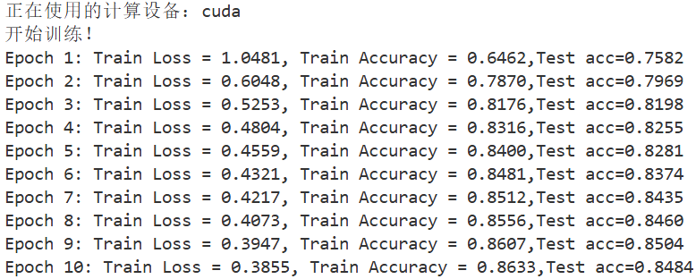

# **简介**

库简介：基于pytorch原生代码，不依赖d2l封装库。\
——————————————————————\
PyTorch版本：2.10.0\
CUDA版本：13.0\
——————————————————————

我已经学会了：基于全连接层的模型的自定义**搭建和训练**；\
简单的数据预处理和参数保存；\
使用GPU进行训练。

示例：进行图像分类的MLP\
源码位置：./pytorch实操/MNIST图像分析.py\
训练结果：\

接下来我简要介绍一下这个库的结构。

## 李沐课程复现

该文件夹中包含了我**已掌握**的课程的pytorch代码实现。

## 知识库

该文件夹中包含了我不定期的对先前知识点的总结。

## data(...)

这些文件夹中包含了课程复现代码中使用到的数据集。

## pytorch实操

该文件夹包含了一些简单有趣的小模型。（虽然目前还没有多少）

## 学习进度.md

这个md文档包含了我对学习进度的记录。

## images

包含了训练结果等图像